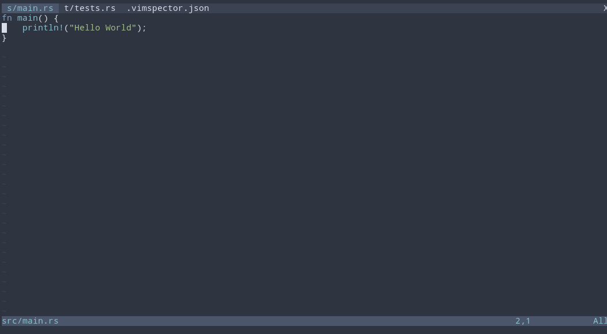

# telescope-vimspector.nvim

Integration for [vimspector](https://github.com/puremourning/vimspector) with
[telescope.nvim](https://github.com/nvim-telescope/telescope.nvim)

# Demo



# Requirements

* [vimspector](https://github.com/puremourning/vimspector) 
* [telescope.nvim](https://github.com/nvim-telescope/telescope.nvim)

# Installation

```viml
Plug 'nvim-telescope/telescope-vimspector.nvim'
```

Load the extension by doing:

```viml
require("telescope").load_extension("vimspector")
```

somewhere after your require('telescope').setup() call.

# Usage

Fuzzy find over vimspector configurations:

```lua
require('telescope').extensions.vimspector.configurations()
```

or 

```
:Telescope vimspector configurations
```
